# StockSage — Design Document

| Field | Value |
|-------|--------|
| **Product** | StockSage — AI Stock Monitor |
| **Version** | 1.0 |
| **Status** | Living document (matches `main` as of May 2026) |
| **Repository** | `t6yjfhsgwg-ops/stocksage` |
| **Stack** | See [§3 Technology stack](#3-technology-stack) |

---

## 1. Purpose & scope

### 1.1 Purpose

StockSage is a single-page **Bloomberg-style** dashboard for retail investors. It aggregates live market data, computes technical **BUY/SELL** signals, shows **price predictions**, highlights a **daily pick**, and provides an **AI chat** assistant—with optional Claude integration and a **freemium** monetization layer (demo).

### 1.2 In scope

- Client-only SPA (no first-party backend in v1)
- Watchlist management and multi-symbol analysis
- Interactive charts with moving averages
- Composite signal engine and prediction model
- AI chat (local rules + optional Anthropic API)
- Freemium plans, pricing UI, feature gates
- Interactive onboarding help tour

### 1.3 Out of scope (v1)

- User authentication / payments (Stripe)
- Real broker sync or trade execution
- SEC filings, fundamentals, or news feeds
- Mobile native apps
- Guaranteed financial accuracy (educational / demo disclaimer)

---

## 2. Requirements

### 2.1 Functional requirements

| ID | Requirement | Priority |
|----|-------------|----------|
| **FR-01** | Display live prices and day change for a configurable watchlist (default 8 tickers). | Must |
| **FR-02** | Display major indices strip: S&P 500, NASDAQ, DOW, VIX, BTC. | Must |
| **FR-03** | Allow user to add tickers via text input (+ button or Enter). | Must |
| **FR-04** | On watchlist row click, load chart, signals, and predictions for active symbol. | Must |
| **FR-05** | Render price chart with close, SMA20, SMA50, and optional 7-day prediction reference line. | Must |
| **FR-06** | Support chart timeframes: 1W, 1M, 3M, 6M, 1Y (gated on Free plan). | Must |
| **FR-07** | Compute composite signal (STRONG BUY → STRONG SELL) from RSI, MACD, SMA cross, Bollinger, volume. | Must |
| **FR-08** | Show per-indicator table with name, value, and BUY/SELL/NEUTRAL. | Must |
| **FR-09** | Signals and predictions must use **3-month history** even when chart uses a shorter range. | Must |
| **FR-10** | Show AI predictions: tomorrow, 7-day, 30-day (30-day gated on Free). | Must |
| **FR-11** | Compute and display **Daily Pick** (highest composite score) with reasons. | Must |
| **FR-12** | Provide AI chat with quick-action chips and free-text input. | Must |
| **FR-13** | Chat works without API key (local fallback); with Anthropic key use Claude Sonnet. | Must |
| **FR-14** | Settings: theme (dark/light), auto-refresh interval, portfolio shares per ticker, API key. | Should |
| **FR-15** | Freemium: Free vs Plus plans with limits and upgrade modal. | Should |
| **FR-16** | Plus: CSV export of watchlist signals. | Should |
| **FR-17** | Interactive help tour (spotlight + hands-on steps). | Should |
| **FR-18** | Manual refresh and periodic auto-refresh of watchlist data. | Should |
| **FR-19** | Show disclaimer banner (not financial advice). | Must |
| **FR-20** | Handle Yahoo/CORS failures with error banner and retry. | Must |

### 2.2 Non-functional requirements

| ID | Requirement | Target |
|----|-------------|--------|
| **NFR-01** | Initial load | Show loading screen until first `refreshAll` completes |
| **NFR-02** | Responsiveness | Usable at ≥1100px; chat collapses to FAB below breakpoint |
| **NFR-03** | Browser support | Modern Chromium, Firefox, Safari (ES modules) |
| **NFR-04** | Node for dev | Node 18+ (Vite 8); `start.ps1` can pin Node 22 on Windows |
| **NFR-05** | Security | API keys in `localStorage` only; user-provided Anthropic key |
| **NFR-06** | Privacy | No server-side storage of user data in v1 |
| **NFR-07** | Maintainability | Single app component + small `src/` modules for tour/pricing/plans |
| **NFR-08** | Deployability | Static `dist/` deployable to Vercel/Netlify |

### 2.3 User stories

1. **As an investor**, I want to see my watchlist at a glance so I can spot movers quickly.
2. **As an investor**, I want a clear BUY/SELL badge and indicator breakdown so I understand *why* a signal exists.
3. **As an investor**, I want to switch chart timeframes without losing indicator quality.
4. **As a new user**, I want a guided tour that lets me click real UI elements.
5. **As a free user**, I want to try core features before upgrading to Plus.
6. **As a power user**, I want to paste my Anthropic API key for richer chat answers.

---

## 3. Technology stack

### 3.1 Stack overview (layer diagram)

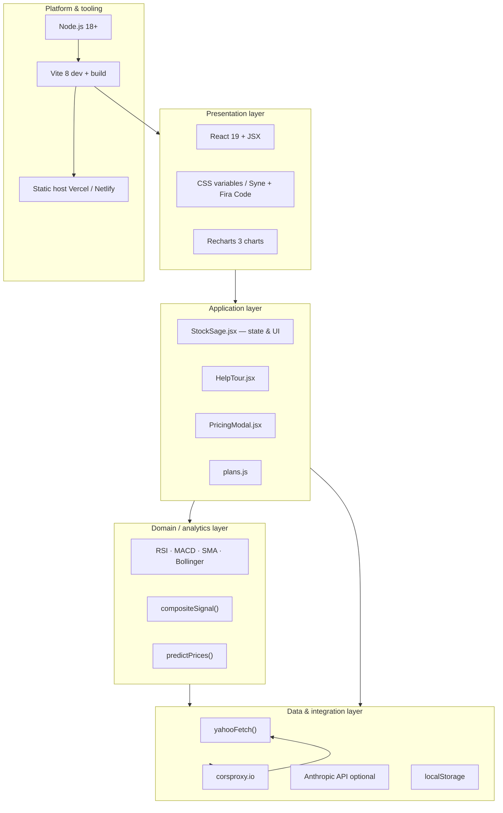

**ASCII stack (for Word / print):**

```
┌─────────────────────────────────────────────────────────────┐
│  PRESENTATION    React 19 · JSX · Recharts · Google Fonts    │
├─────────────────────────────────────────────────────────────┤
│  APPLICATION     StockSage.jsx · HelpTour · PricingModal     │
│                  plans.js (freemium)                         │
├─────────────────────────────────────────────────────────────┤
│  DOMAIN          Technical indicators · BUY/SELL signals     │
│                  Price predictions · Daily pick logic        │
├─────────────────────────────────────────────────────────────┤
│  DATA            yahooFetch → corsproxy → Yahoo Finance      │
│                  Anthropic Claude (optional) · localStorage  │
├─────────────────────────────────────────────────────────────┤
│  PLATFORM        Vite 8 · Node 18+ · npm · Git / GitHub      │
│  DEPLOY          Static dist/ → Vercel or Netlify            │
└─────────────────────────────────────────────────────────────┘
```

### 3.2 Full technology inventory

| Category | Technology | Version | Role |
|----------|------------|---------|------|
| **UI framework** | React | ^19.2.6 | Component model, hooks, SPA |
| **DOM** | react-dom | ^19.2.6 | Render to `#root` |
| **Charts** | Recharts | ^3.8.1 | ComposedChart, Line, axes, tooltip |
| **Recharts peer** | react-is | ^19.2.6 | Required by Recharts |
| **Language** | JavaScript (ES modules) | ES2020+ | `.jsx` / `.js`, no TypeScript in v1 |
| **Bundler / dev server** | Vite | ^8.0.14 | HMR, `npm run dev`, production build |
| **React compile** | @vitejs/plugin-react | ^6.0.2 | Fast Refresh, JSX transform |
| **Fonts** | Google Fonts | CDN | Syne (UI), Fira Code (data) |
| **Styling** | Custom CSS | — | CSS variables in `StockSage.jsx` |
| **Market data** | Yahoo Finance Chart API | v8 | OHLCV, quote meta |
| **CORS proxy** | corsproxy.io | Public | Browser → Yahoo (no backend) |
| **AI (optional)** | Anthropic Messages API | 2023-06-01 | Claude Sonnet chat |
| **AI (fallback)** | Local rules engine | — | `localChatReply()` in-app |
| **Client storage** | localStorage | Web API | Plan, API key, portfolio, tour |
| **Package manager** | npm | — | `package.json` dependencies |
| **Runtime (dev)** | Node.js | 18+ (22 via `start.ps1`) | Vite CLI |
| **Shell (Windows)** | PowerShell | — | `start.ps1` launcher |
| **SCM / remote** | Git + GitHub | — | `t6yjfhsgwg-ops/stocksage` |
| **Hosting (prod)** | Vercel / Netlify | — | Static `dist/` after `vite build` |
| **CI (optional)** | GitHub → Vercel | — | Push-to-deploy |

### 3.3 npm dependencies (`package.json`)

| Package | Type | Purpose |
|---------|------|---------|
| `react` | dependency | UI |
| `react-dom` | dependency | Mount app |
| `react-is` | dependency | Recharts compatibility |
| `recharts` | dependency | Stock charts |
| `vite` | devDependency | Build tool |
| `@vitejs/plugin-react` | devDependency | JSX + HMR |

### 3.4 Browser & runtime requirements

| Requirement | Detail |
|-------------|--------|
| Browsers | Chrome, Edge, Firefox, Safari (recent) |
| ES modules | Required (`type="module"` in Vite output) |
| `fetch` | Required for Yahoo + Anthropic |
| `localStorage` | Required for settings and freemium |
| Screen width | ≥1100px recommended; mobile chat uses FAB |
| Network | Outbound HTTPS to proxy, Yahoo, optional Anthropic |

### 3.5 What is *not* in the stack (v1)

| Not used | Note |
|----------|------|
| TypeScript | Plain JSX only |
| Redux / Zustand | React `useState` only |
| Next.js / Remix | Vite SPA only |
| Express / FastAPI backend | Client-only |
| PostgreSQL / Redis | No server DB |
| WebSocket | Polling via `setInterval` refresh |
| Tailwind / MUI | Custom CSS |
| Finnhub / Alpha Vantage | Yahoo via proxy only |

---

## 4. System architecture

### 4.1 C4 context diagram (system context)

Shows StockSage in relation to users and external systems.

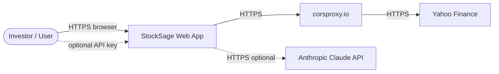

```
        ┌──────────┐
        │   User   │
        └────┬─────┘
             │ HTTPS
             ▼
    ┌────────────────┐
    │   StockSage    │
    │   (SPA)        │
    └───────┬────────┘
            │
     ┌──────┴──────┐
     ▼             ▼
┌─────────┐   ┌──────────────┐
│corsproxy│──►│Yahoo Finance │
└─────────┘   └──────────────┘
     optional: Anthropic API
```

### 4.2 Container diagram (deployable units)

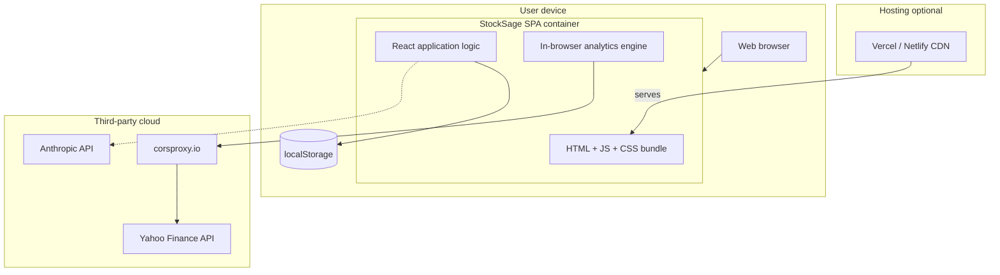

### 4.3 Component diagram (inside the SPA)

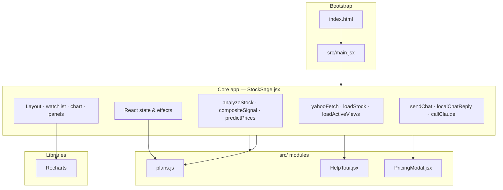

### 4.4 Deployment architecture

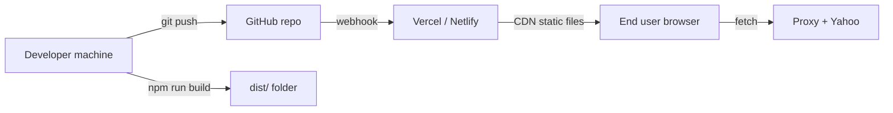

| Stage | Command / path | Output |
|-------|----------------|--------|
| Local dev | `npm run dev` or `start.ps1` | `http://localhost:5173` |
| Build | `npm run build` | `dist/index.html` + hashed JS/CSS |
| Preview | `npm run preview` | Local preview of `dist/` |
| Production | Deploy `dist/` | Global CDN URL |

### 4.5 Data flow architecture (market + signals)

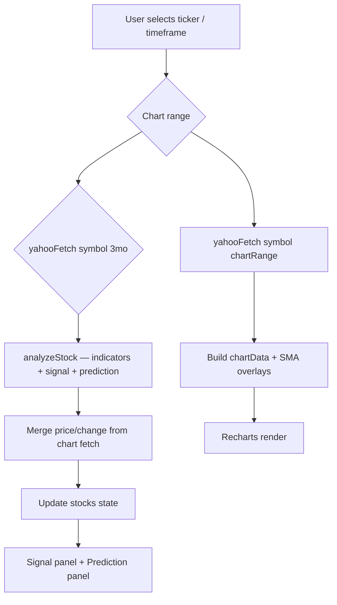

### 4.6 High-level architecture (summary)

StockSage is a **pure client application**. All market data and AI calls originate from the browser.

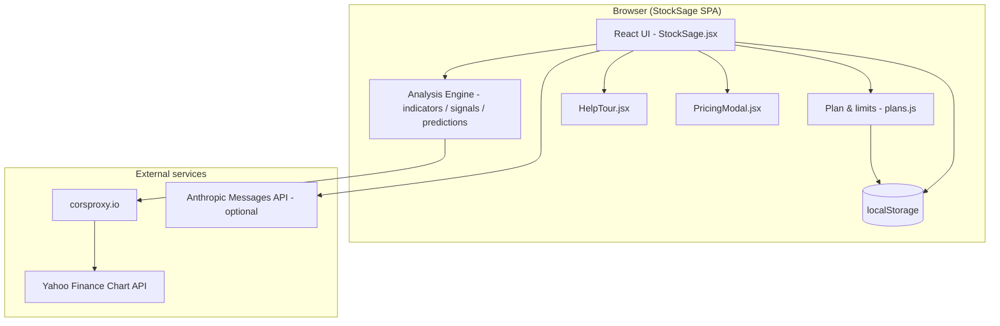

### 4.7 Layered view

| Layer | Responsibility | Location |
|-------|----------------|----------|
| **Presentation** | Layout, panels, modals, CSS-in-JS string | `StockSage.jsx` (JSX + `css`) |
| **Application state** | React hooks, effects, orchestration | `StockSage.jsx` `export default function StockSage` |
| **Domain / analytics** | Indicators, signals, predictions | `StockSage.jsx` pure functions |
| **Data access** | HTTP fetch via CORS proxy | `yahooFetch()` |
| **Cross-cutting** | Plans, tour, pricing | `src/plans.js`, `src/HelpTour.jsx`, `src/PricingModal.jsx` |
| **Bootstrap** | React mount | `src/main.jsx`, `index.html` |

### 4.8 Runtime data flow

#### 4.8.1 Application bootstrap

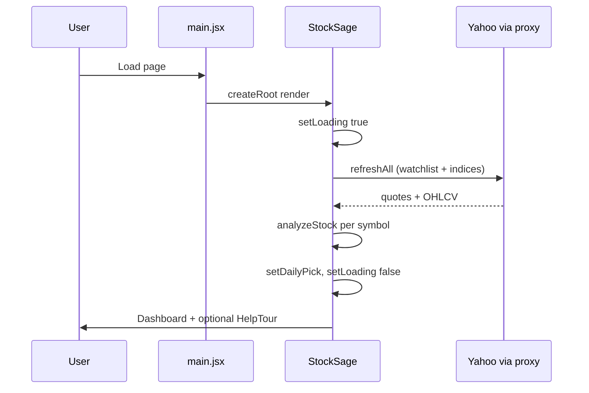

#### 4.8.2 Active symbol change / timeframe change

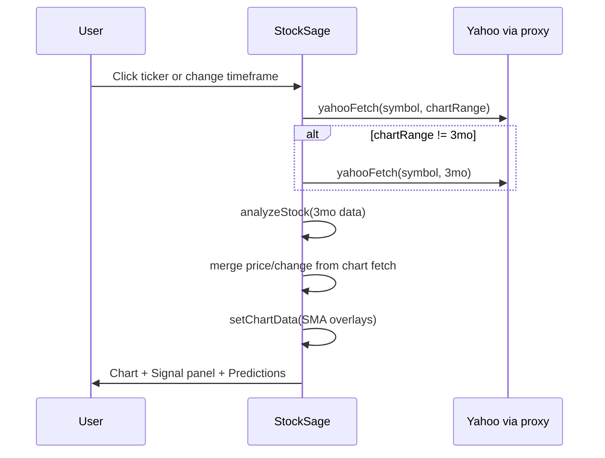

**Design decision (FR-09):** Chart range and analysis range are **decoupled** in `loadActiveViews()` so a 1W chart does not destroy MACD/RSI/SMA50 calculations.

### 4.9 UI layout architecture

```
┌─────────────────────────────────────────────────────────────────┐
│ Disclaimer bar                                                   │
├─────────────────────────────────────────────────────────────────┤
│ Plan bar (badge, chat quota, Join Free / Upgrade, Export CSV)   │
├─────────────────────────────────────────────────────────────────┤
│ Market strip (indices)                                           │
├──────────┬──────────────────────────────────────┬───────────────┤
│ Sidebar  │ Main                                    │ Chat panel  │
│ Watchlist│ • Daily Pick                            │ Messages    │
│ + add    │ • Price chart + timeframe tabs          │ Chips       │
│          │ • Signal panel + indicator table        │ Input       │
│          │ • AI Prediction panel                   │             │
└──────────┴──────────────────────────────────────┴───────────────┘
     Fixed: Help, Settings (top-right) | Chat FAB (mobile)
     Modals: PricingModal, HelpTour overlay
```

---

## 5. Code structure

### 5.1 Repository map

```
stocksage/
├── index.html              # Shell, fonts, #root
├── StockSage.jsx           # Main app (~1000 lines): UI + analytics + state
├── src/
│   ├── main.jsx            # React entry
│   ├── plans.js            # Freemium plan definitions & localStorage
│   ├── PricingModal.jsx    # Pricing / compare / testimonials
│   ├── HelpTour.jsx        # Interactive spotlight tour
│   └── FeatureLock.jsx     # Optional overlay (predictions lock uses inline CSS now)
├── docs/
│   └── DESIGN.md           # This document
├── vite.config.js
├── package.json
├── start.ps1               # Windows: Node 22 + vite
├── README.md
└── HELP-VIDEO-SCRIPT.md
```

### 5.2 Module dependency graph

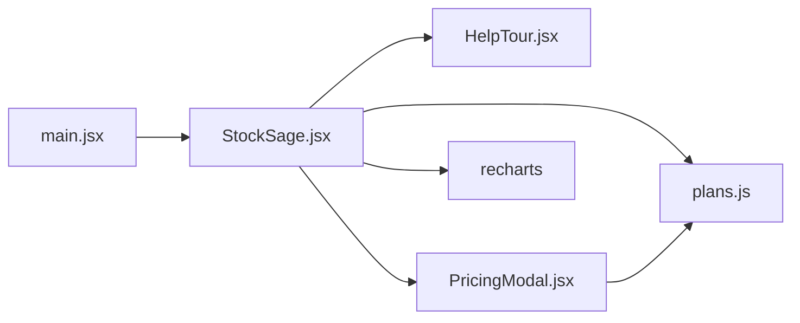

### 5.3 Key entry points

**Bootstrap** (`src/main.jsx`):

```javascript
import StockSage from "../StockSage.jsx";

createRoot(document.getElementById("root")).render(
  <React.StrictMode>
    <StockSage />
  </React.StrictMode>
);
```

**Market data fetch** (`StockSage.jsx`):

```javascript
async function yahooFetch(symbol, range = "3mo") {
  const url = `https://query1.finance.yahoo.com/v8/finance/chart/${encodeURIComponent(symbol)}?interval=1d&range=${range}`;
  const proxy = `https://corsproxy.io/?${encodeURIComponent(url)}`;
  const res = await fetch(proxy);
  // ... parse chart.result[0] → { symbol, name, price, points[] }
}
```

**Decoupled chart vs analysis** (`StockSage.jsx`):

```javascript
const loadActiveViews = useCallback(async (symbol, tf) => {
  const chartRange = RANGE_MAP[tf] || "3mo";
  const chartRaw = await yahooFetch(symbol, chartRange);
  const analysisRaw = chartRange === "3mo" ? chartRaw : await yahooFetch(symbol, "3mo");
  const analyzed = analyzeStock(analysisRaw);
  const merged = {
    ...analyzed,
    price: chartRaw.price ?? analyzed.price,
    change: /* from chartRaw */,
  };
  // build chart series with sma20 / sma50 from chartRaw.points
  return { stock: merged, chart };
}, []);
```

---

## 6. Domain model & algorithms

### 6.1 Core entities

#### Stock quote (after `analyzeStock`)

| Field | Type | Description |
|-------|------|-------------|
| `symbol` | string | Ticker |
| `name` | string | Company name from Yahoo meta |
| `price` | number | Latest price |
| `change` | number | Day change % |
| `points` | array | OHLCV daily points |
| `signal` | object | Composite signal (see below) |
| `prediction` | object | Price projections (see below) |

#### Signal object

| Field | Type | Description |
|-------|------|-------------|
| `score` | number | 0–1 composite |
| `label` | string | STRONG BUY … STRONG SELL |
| `cls` | string | CSS class: `strong-buy`, `buy`, `hold`, `sell`, `strong-sell` |
| `rows` | array | `{ name, value, signal }` per indicator |
| `rsi` | number? | Latest RSI(14) |
| `macd` | object? | MACD internals |

#### Prediction object

| Field | Type | Description |
|-------|------|-------------|
| `tomorrow`, `d7`, `d30` | number | Projected prices |
| `confidence` | number | R² × 100 |
| `direction` | `up` \| `down` | Trend sign |
| `bandLow`, `bandHigh` | number | 7-day confidence band |
| `model` | string | Display name |

### 6.2 Composite signal algorithm

`compositeSignal(closes, volumes, price)`:

1. **RSI(14)** — oversold &lt; 30 → bullish score; overbought &gt; 70 → bearish.
2. **MACD** — histogram &gt; 0 → bullish (requires ≥26 bars).
3. **SMA 20/50** — golden cross → bullish; death cross → bearish.
4. **Bollinger(20)** — price near lower band → bullish; near upper → bearish.
5. **Volume** — spike (&gt;1.3× 20-day avg) with price direction.

Composite `score` = average of indicator scores. Mapped via `SIGNAL_LABELS` thresholds:

| Min score | Label |
|-----------|--------|
| 0.8 | STRONG BUY |
| 0.6 | BUY |
| 0.4 | HOLD |
| 0.2 | SELL |
| 0.0 | STRONG SELL |

### 6.3 Prediction algorithm

`predictPrices(points)` (educational model):

- Linear regression on last 30 closes.
- Exponential smoothing + weekly seasonality.
- RSI adjustment factor on trend.
- Projects +1, +7, +30 days; confidence from R².

**Not** a validated forecasting model — UI must keep disclaimer visible.

### 5.4 Daily pick

After `refreshAll`, select watchlist symbol with highest `signal.score`. Build `reasons` from indicator rows where `signal === "BUY"`, padded to three lines if needed.

---

## 7. Freemium architecture

### 7.1 Plans (`src/plans.js`)

| Capability | Free | Plus |
|------------|------|------|
| Watchlist size | 5 | 20 |
| AI chat | 10 / day | Unlimited |
| Chart timeframes | 1M, 3M | All |
| Predictions | 7d + blurred 30d | Full + bands |
| CSV export | No | Yes |
| Auto-refresh 1 min | No | Yes |
| Full indicator table | Yes | Yes |

### 7.2 Persistence keys (localStorage)

| Key | Purpose |
|-----|---------|
| `stocksage_plan` | `free` or `plus` |
| `stocksage_trial_end` | Epoch ms for Plus trial |
| `stocksage_chat_day` | Date string for chat quota reset |
| `stocksage_chat_count` | Messages sent today |
| `stocksage_api_key` | Anthropic API key |
| `stocksage_portfolio` | JSON map symbol → shares |
| `stocksage_help_seen` | Help tour completed |

### 7.3 Gating flow

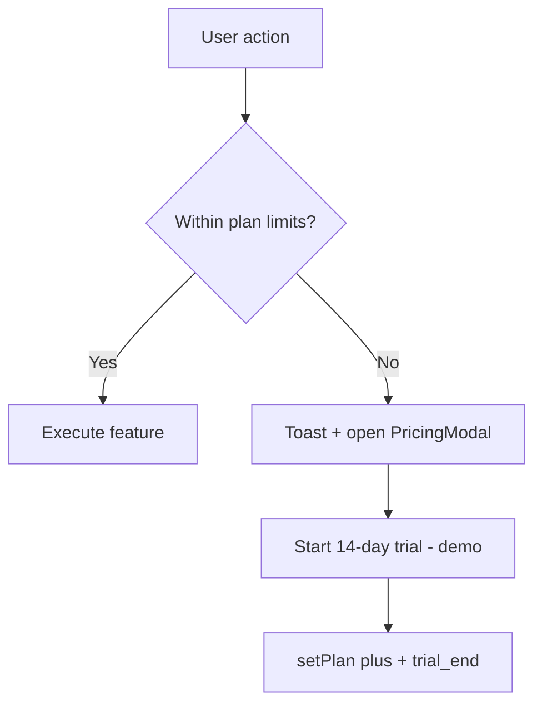

Trial is **client-side demo only** — no payment verification.

---

## 8. AI chat architecture

### 8.1 Modes

| Mode | Condition | Implementation |
|------|-----------|----------------|
| **Local analyst** | No API key or API error | `localChatReply()` keyword rules |
| **Claude** | Valid `stocksage_api_key` | `callClaude()` → Anthropic Messages API |

### 8.2 Context injection

`buildContext()` serializes watchlist: symbol, price, change %, signal label. Prepended to Claude user message.

### 8.3 System prompt (summary)

StockSage persona: concise, indicator-aware, bullet formatting, &lt;200 words, **not financial advice** disclaimer required.

---

## 9. Help tour architecture (`src/HelpTour.jsx`)

- **Type:** Interactive spotlight tour (not video).
- **Steps:** 10 steps with `data-tour` anchors on live DOM.
- **Overlay:** Four-panel dimming + green ring around target rect.
- **Advance rules:**
  - `info` steps → Next button
  - `click` steps → user must click watchlist / timeframe / chat / settings
- **First visit:** Auto-open if `stocksage_help_seen` absent.

---

## 10. External integrations

### 10.1 Yahoo Finance Chart API

| Item | Value |
|------|--------|
| Endpoint | `https://query1.finance.yahoo.com/v8/finance/chart/{symbol}` |
| Params | `interval=1d`, `range={5d\|1mo\|3mo\|6mo\|1y}` |
| CORS | Blocked direct → `corsproxy.io` wrapper |
| Risk | Proxy rate limits, Yahoo schema changes, no SLA |

### 10.2 Anthropic API (optional)

| Item | Value |
|------|--------|
| Endpoint | `https://api.anthropic.com/v1/messages` |
| Model | `claude-sonnet-4-20250514` |
| Auth | User-supplied `x-api-key` |
| Note | Browser direct access header enabled (dev/demo only; production should use backend proxy) |

---

## 11. State management

All state is **React `useState`** in `StockSage` — no Redux/Zustand.

| State | Purpose |
|-------|---------|
| `watchlist` | string[] tickers |
| `stocks` | Record&lt;symbol, analyzed stock&gt; |
| `indices` | Index quote map |
| `active` | Selected symbol |
| `timeframe` | Chart TF key |
| `chartData` | Recharts series |
| `dailyPick` | Best symbol + reasons |
| `messages` | Chat history |
| `planId` | Current freemium plan |
| `loading`, `error`, `toast` | UX feedback |

Side effects:

- Mount → `refreshAll()`
- `[active, timeframe]` → `loadActiveViews()`
- `[refreshMin]` → `setInterval(refreshAll)`

---

## 12. Styling & theming

- **Fonts:** Syne (UI), Fira Code (data).
- **CSS:** Single template string `const css` injected via `<style>{css}</style>`.
- **Theme:** `.light` class on root toggles CSS variables.
- **Colors:** Dark terminal aesthetic; green = positive / CTA.

---

## 13. Build & deployment

### 13.1 Development

```powershell
cd stocksage
.\start.ps1          # Windows helper (Node 22)
# or: npm install && npm run dev
```

Dev server: `http://localhost:5173` (Vite, port in `vite.config.js`).

### 13.2 Production build

```bash
npm run build   # output: dist/
npm run preview
```

### 13.3 Deploy target

- **Vercel** (recommended): Framework preset **Vite**, output `dist`.
- Environment variables: none required for core app; optional docs for Anthropic key UX.

---

## 14. Security & compliance

| Topic | Current behavior | Recommendation |
|-------|------------------|----------------|
| API keys in browser | Anthropic key in localStorage | Move to backend proxy for production |
| Market data | Third-party proxy | Consider licensed data provider for commercial use |
| Financial advice | Disclaimer banner | Keep visible; do not imply guaranteed returns |
| Payments | Trial is localStorage only | Integrate Stripe + auth before real billing |
| CORS proxy | Public corsproxy.io | Self-host proxy or server-side fetch |

---

## 15. Error handling

| Scenario | Behavior |
|----------|----------|
| Yahoo/proxy failure | `error` state, red banner, **Try Again** |
| Partial watchlist failure | `Promise.allSettled` — successful symbols still load |
| Claude API failure | Fallback to `localChatReply` + error note in message |
| Chat limit exceeded | Toast + open pricing modal |
| Watchlist limit | Toast + upgrade CTA |

---

## 16. Testing strategy (recommended)

| Area | Approach |
|------|----------|
| `compositeSignal` | Unit tests with fixture OHLCV arrays |
| `predictPrices` | Snapshot tests for monotonic inputs |
| `plans.js` | Test quota reset at day boundary |
| `loadActiveViews` | Mock `yahooFetch`; assert 3mo used for analysis |
| E2E | Playwright: load app, click ticker, assert signal table rows |

*Note: Test suite not yet implemented in repo.*

---

## 17. Future enhancements

1. **Backend** — BFF for Yahoo + Anthropic; hide API keys.
2. **Auth** — Supabase/Clerk + Stripe subscriptions.
3. **Persistence** — Cloud watchlists and portfolios.
4. **Alerts** — Email/push on signal changes.
5. **Fundamentals** — P/E, earnings, Finnhub alignment (see AlphaLens sibling project).
6. **Split `StockSage.jsx`** — `analytics/`, `hooks/`, `components/` modules.
7. **Tests** — Vitest + Playwright in CI.

---

## 18. Appendix A — Constants reference

```javascript
const DEFAULT_WATCHLIST = ["AAPL", "TSLA", "MSFT", "NVDA", "GOOGL", "AMZN", "META", "SPY"];

const RANGE_MAP = {
  "1W": "5d",
  "1M": "1mo",
  "3M": "3mo",
  "6M": "6mo",
  "1Y": "1y",
};
```

## 19. Appendix B — `data-tour` anchors (help system)

| `data-tour` value | UI element |
|-------------------|------------|
| `market-strip` | Indices bar |
| `watchlist` | Sidebar |
| `daily-pick` | Daily pick card |
| `chart` | Price chart panel |
| `signals` | Signal panel |
| `predictions` | Prediction panel |
| `chat` | Chat aside |
| `settings-btn` | Settings button |

## 20. Appendix C — Related projects

| Project | Relationship |
|---------|----------------|
| **AlphaLens AI** (`alphalens-ai/`) | Separate Danelfin-style static site + Railway API; multi-page marketing + rankings |
| **arena-fps** | Unrelated game project |

---

## 21. Document history

| Date | Author | Change |
|------|--------|--------|
| 2026-05-23 | Engineering | Initial design document |
| 2026-05-30 | Engineering | Added full tech stack + architecture diagrams (C4, deployment, data flow) |

---

*StockSage is for informational and educational purposes only. Not financial advice.*
